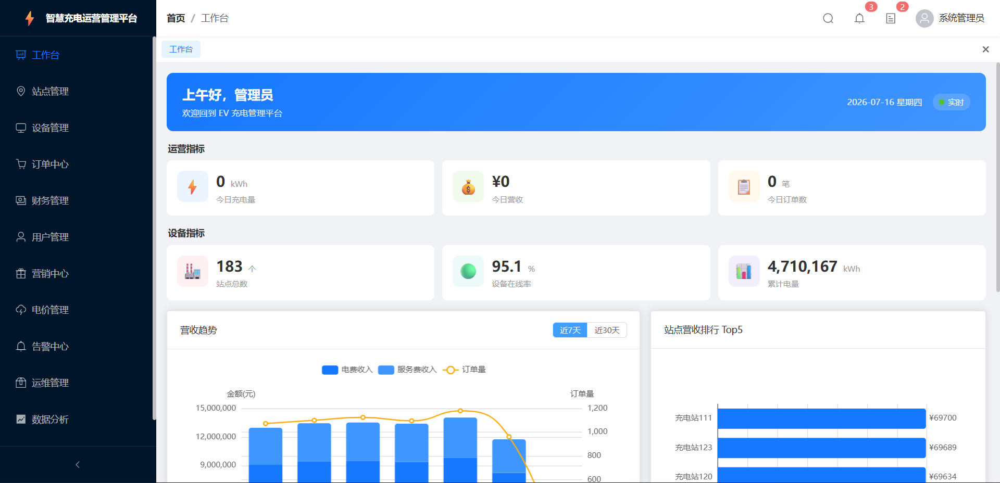
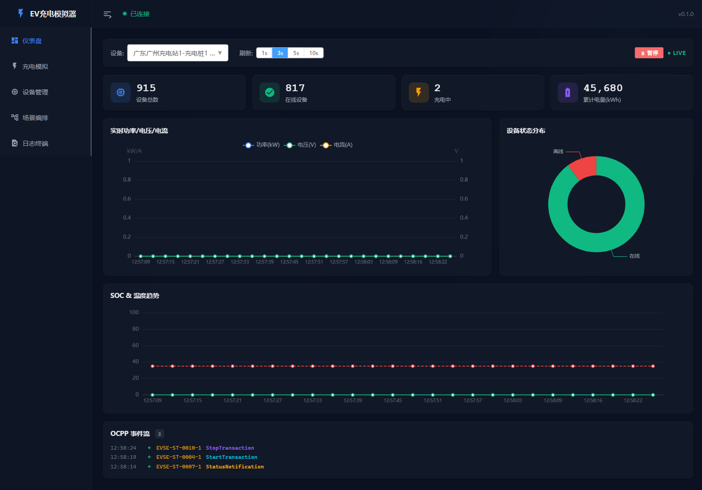
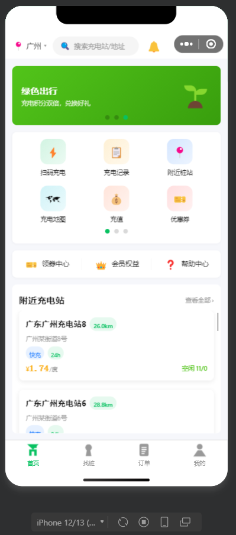
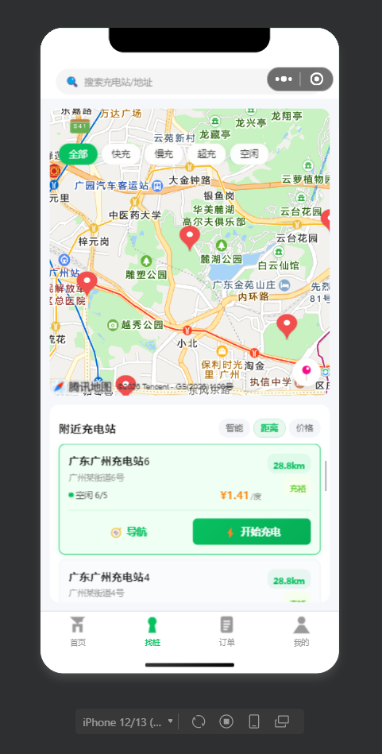
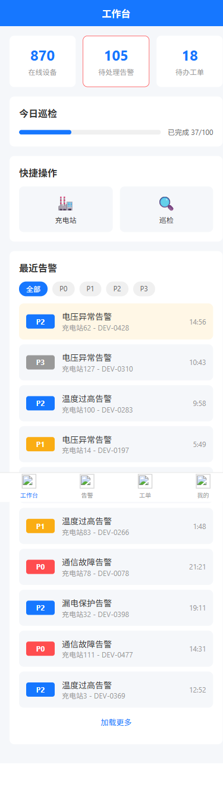

# ⚡ EV充电平台 (EV Charging Platform)

> 多租户电动汽车充电站运营管理 SaaS 平台 — 全栈四端 + 微服务后端

[](https://openjdk.org/)
[](https://spring.io/projects/spring-boot)
[](https://vuejs.org/)
[](https://www.postgresql.org/)
[](LICENSE)

---

## 📖 项目简介

面向电动汽车充电运营领域的多租户 SaaS 平台，覆盖**充电站管理、设备监控、订单结算、告警运维、用户充电全流程**。后端采用 Spring Cloud 微服务架构（5 个业务服务 + 1 个网关），前端四端并行开发，支撑 **200+ 充电站、1000+ 设备、10 万+ 订单**的运营规模。

### 四端应用预览

<table>
<tr>
<td align="center"><b>后台管理系统 Web</b></td>
<td align="center"><b>OCPP 充电模拟器</b></td>
</tr>
<tr>
<td></td>
<td></td>
</tr>
<tr>
<td align="center"><b>用户端小程序 / H5</b></td>
<td align="center"><b>运维 APP / H5</b></td>
</tr>
<tr>
<td> </td>
<td></td>
</tr>
</table>

---

## 🏗 技术架构

### 后端技术栈

| 层级 | 技术选型 | 用途 |
|------|---------|------|
| **语言** | Java 21 (Virtual Threads) | 高并发轻量级线程 |
| **框架** | Spring Boot 3.3 + Spring Cloud Alibaba 2023 | 微服务基座 |
| **网关** | Spring Cloud Gateway | 统一入口、路由、限流、安全 |
| **注册中心** | Nacos 2.3 | 服务发现 + 配置中心 |
| **限流熔断** | Sentinel 1.8 | 流量控制、熔断降级 |
| **ORM** | MyBatis-Plus | CRUD 增强、多租户拦截器、自动填充 |
| **数据库** | PostgreSQL 16 (PostGIS) | 主数据存储、地理空间查询 |
| **缓存** | Caffeine (L1) + Redis Cluster (L2) | 两级缓存、分布式锁、会话管理 |
| **消息队列** | Kafka | 事件驱动、订单状态异步同步 |
| **实时通信** | WebSocket (STOMP) | 充电状态推送、大盘实时更新 |
| **数据库迁移** | Flyway | Schema 版本化管理 |
| **可观测性** | OpenTelemetry + Prometheus + Grafana | 链路追踪 + 指标监控 |

### 前端技术栈

| 层级 | 技术选型 | 用途 |
|------|---------|------|
| **框架** | Vue 3 + TypeScript + Composition API | 四端统一前端技术栈 |
| **UI 组件** | Element Plus | 管理后台 / 模拟器 |
| **跨端方案** | UniApp + Vue 3 | 用户小程序 + 运维 App（H5/小程序） |
| **状态管理** | Pinia | 全局状态管理 |
| **样式** | TailwindCSS | 原子化 CSS |
| **可视化** | ECharts 5 | 数据看板、趋势图、实时曲线 |
| **地图** | 腾讯地图 SDK | 充电站定位、地图选点 |
| **终端模拟** | xterm.js 风格 | OCPP 协议事件流 |
| **工程化** | pnpm workspace + Vite | Monorepo 统一构建 |

### 系统架构图

```
┌──────────────────────────────────────────────────────────────────┐
│                        客户端层（四端）                            │
│  ┌──────────┐  ┌──────────┐  ┌──────────┐  ┌──────────────┐     │
│  │ admin-web│  │  ops-app │  │user-mini │  │ simulator-web│     │
│  │ Vue3+EP  │  │ UniApp   │  │ UniApp   │  │ Vue3+EP      │     │
│  │ :5173    │  │ :5175    │  │ :5176    │  │ :5177        │     │
│  └────┬─────┘  └────┬─────┘  └────┬─────┘  └──────┬───────┘     │
└───────┼──────────────┼─────────────┼───────────────┼─────────────┘
        │              │             │               │
┌───────┴──────────────┴─────────────┴───────────────┴─────────────┐
│                   Spring Cloud Gateway (:8080)                    │
│            JWT解析 / 路由转发 / 限流 / 安全头 / CORS               │
└───────┬──────────────┬─────────────┬───────────────┬─────────────┘
        │              │             │               │
┌───────┴───┐  ┌───────┴───┐  ┌─────┴─────┐  ┌─────┴─────┐  ┌─────┴─────┐
│ identity  │  │  station  │  │ charging  │  │   order   │  │ simulator │
│ 认证服务   │  │  站点服务  │  │  充电服务  │  │  订单服务  │  │  模拟服务  │
│  :8081    │  │  :8082    │  │  :8083    │  │  :8084    │  │  :8085    │
└─────┬─────┘  └─────┬─────┘  └─────┬─────┘  └─────┬─────┘  └─────┬─────┘
      │              │              │              │              │
┌─────┴──────────────┴──────────────┴──────────────┴──────────────┴─────┐
│                           基础设施层                                    │
│    PostgreSQL │ Redis Cluster │ Kafka │ Nacos │ Sentinel │ MinIO     │
└──────────────────────────────────────────────────────────────────────┘
```

---

## 📁 项目结构

```
demo07/
├── apps/                                  # 前端四端应用
│   ├── admin-web/                         # 后台管理系统 (Vue 3 + Element Plus, :5173)
│   │   └── src/views/
│   │       ├── dashboard/                 #   数据看板（KPI卡片、营收趋势、站点排名）
│   │       ├── station/                   #   充电站管理（CRUD、地图选点）
│   │       ├── device/                    #   设备管理（状态监控、详情弹窗）
│   │       ├── order/                     #   订单管理（状态筛选、详情抽屉）
│   │       ├── alert/                     #   告警管理（P0~P3分级）
│   │       ├── ops/                       #   工单管理
│   │       ├── finance/                   #   财务结算
│   │       ├── pricing/                   #   定价策略
│   │       └── marketing/                 #   营销活动
│   ├── ops-app/                           # 运维App (UniApp + Vue 3, :5175)
│   │   └── src/pages/
│   │       ├── index/                     #   工作台（待办、快捷操作、告警列表）
│   │       ├── station/                   #   站点巡检
│   │       ├── device/                    #   设备管理
│   │       ├── alert/                     #   告警处理
│   │       ├── workorder/                 #   工单管理
│   │       ├── inspection/                #   巡检任务
│   │       └── profile/                   #   个人中心
│   ├── user-miniapp/                      # 用户小程序 (UniApp + Vue 3, :5176)
│   │   └── src/pages/
│   │       ├── index/                     #   首页（余额、充电状态、附近站点）
│   │       ├── map/                       #   找桩地图（60:40地图/列表、无限滚动）
│   │       ├── charging/                  #   充电监控（SOC进度、功率/电压/电流/温度）
│   │       ├── orders/                    #   我的订单
│   │       ├── profile/                   #   个人中心（编辑资料、余额充值）
│   │       └── login/                     #   登录（手机号+验证码）
│   └── simulator-web/                     # OCPP模拟器 (Vue 3 + Element Plus, :5177)
│       └── src/views/
│           ├── dashboard/                 #   仪表盘（实时指标、SOC/功率趋势、设备分布）
│           ├── charging/                  #   充电仿真（4通道实时曲线、OCPP消息）
│           ├── scenario/                  #   场景编排
│           └── ocpp-terminal/             #   OCPP终端（协议报文调试）
│
├── backend/                               # 后端微服务
│   ├── ev-gateway/                        # API网关 (:8080)
│   │   └── filter/
│   │       ├── AuthGlobalFilter           #   JWT解析 + 用户上下文注入
│   │       ├── PathTraversalFilter        #   防路径穿越攻击
│   │       └── SecurityHeadersFilter      #   安全响应头注入
│   ├── ev-common/                         # 公共模块
│   │   ├── ev-common-core/                #   核心：统一响应R<T>、分页、异常体系、事件定义
│   │   ├── ev-common-mybatis/             #   数据库：BaseEntity、多租户拦截、自动填充
│   │   ├── ev-common-redis/               #   缓存：TwoLevelCache、IdempotentAspect、RedisLock
│   │   └── ev-common-security/            #   安全：JWT工具、AuthInterceptor、审计日志AOP
│   └── ev-service/                        # 业务服务
│       ├── ev-service-identity/           #   认证服务 (:8081) — 登录/RBAC/用户管理/短信验证
│       ├── ev-service-station/            #   站点服务 (:8082) — 充电站/设备/连接器/地理查询
│       ├── ev-service-charging/           #   充电服务 (:8083) — 会话管理/SOC算法/WebSocket推送
│       ├── ev-service-order/              #   订单服务 (:8084) — 订单/告警/工单/巡检/财务/看板
│       └── ev-service-simulator/          #   模拟服务 (:8085) — OCPP协议/充电仿真/场景编排
│
├── docker/                                # Docker基础设施
│   ├── docker-compose.yml                 #   PostgreSQL + Redis + Kafka + Nacos + MinIO
│   └── init/                              #   数据库初始化脚本
│
└── 后端/ & 前端/                           # Prompt规范文档（中文AI编码提示词）
```

---

## 🚀 快速启动

### 前置要求

| 工具 | 版本 | 用途 |
|------|------|------|
| Docker Desktop | 最新版 | 基础设施容器 |
| JDK | 21+ | 后端编译运行 |
| Node.js | 18+ | 前端构建运行 |
| pnpm | 8+ | 前端包管理 |

### 一键启动（推荐）

```bash
# 克隆仓库
git clone https://github.com/SharerJw/Charging-Station.git
cd Charging-Station

# Windows
start.bat

# Linux/Mac
chmod +x start.sh && ./start.sh
```

脚本自动执行：启动 Docker 容器 → 构建后端 → 启动 6 个服务 → 安装前端依赖 → 启动 4 个前端 App

### 手动启动

<details>
<summary>点击展开详细步骤</summary>

#### 1. 启动基础设施
```bash
cd docker && docker compose up -d
```

#### 2. 构建并启动后端
```bash
cd backend
./gradlew build -x test

# 分别在 6 个终端启动
./gradlew :ev-gateway:bootRun
./gradlew :ev-service:ev-service-identity:bootRun
./gradlew :ev-service:ev-service-station:bootRun
./gradlew :ev-service:ev-service-order:bootRun
./gradlew :ev-service:ev-service-charging:bootRun
./gradlew :ev-service:ev-service-simulator:bootRun
```

#### 3. 启动前端
```bash
# 后台管理系统 (:5173)
cd apps/admin-web && pnpm install && pnpm dev

# 运维App H5 (:5175)
cd apps/ops-app && pnpm install && pnpm dev:h5

# 用户小程序 H5 (:5176)
cd apps/user-miniapp && pnpm install && pnpm dev:h5

# OCPP模拟器 (:5177)
cd apps/simulator-web && pnpm install && pnpm dev
```

</details>

---

## 🔑 演示账号

| 端 | 用户名 | 密码 | 说明 |
|----|--------|------|------|
| 后台管理 Web | `admin` | `admin123` | 管理员，全部权限 |
| 运维 App/H5 | `ops1` | `ops123` | 运维工程师 |
| 用户端小程序 | `13800000001` | `123456` | 普通用户（验证码自动填充） |

> 登录页已预填默认账号密码，直接点击登录即可体验。

---

## 🏛 核心业务模块

### 订单状态机

```
CREATED → CHARGING → STOPPING → STOPPED → SETTLING → SETTLED → PAYING → PAID
                                                     ↘ REFUNDING → REFUNDED
         → CANCELLED（未开始充电可取消）
         → ABNORMAL（充电异常中断）
```

### 充电实时会话管理

- **ConcurrentHashMap 会话池**：维护活跃充电会话，支持毫秒级读写
- **Redis 用户会话追踪**：`charging:current:{userId}` 跨页面状态查询
- **SOC 平滑递增算法**：<80% 阶段 +1~3%/s（快充），≥80% 阶段 +0~1%/s（涓流）
- **WebSocket 实时推送**：充电状态变更毫秒级通知前端

### 两级缓存架构

```
读路径: L1 (Caffeine, 纳秒级) → L2 (Redis, 毫秒级) → DB
写路径: 删除 L1 → 写 DB → 延迟 500ms 删除 L2 (延迟双删)
命中率: L1 90%+ | L2 99%+
```

### 安全体系（七层防护）

1. **JWT 认证**：Gateway 统一解析，X-Token 头注入下游
2. **RBAC 权限**：用户 → 角色 → 菜单三级模型
3. **数据权限**：四级作用域（全部/本机构及下级/仅本机构/仅本人）
4. **多租户隔离**：MyBatis 拦截器自动注入 tenant_id
5. **审计日志**：AOP 切面记录操作人、IP、URI、耗时
6. **接口幂等**：Redis SETNX + Idempotency-Key，防重复提交
7. **登录限流**：Redis 滑动窗口，防暴力破解

---

## 📡 API 端点

所有 API 通过 Gateway (`:8080`) 统一路由：

| 服务 | 路径前缀 | 说明 |
|------|---------|------|
| 认证服务 | `/api/auth/*`, `/api/v1/auth/*`, `/api/v1/ops/auth/*` | 登录、注册、验证码 |
| 站点服务 | `/api/stations/*`, `/api/v1/stations/*`, `/api/devices/*` | 充电站、设备、连接器 |
| 充电服务 | `/api/v1/charging/*` | 启动/停止/状态查询 |
| 订单服务 | `/api/v1/orders/*`, `/api/dashboard/*`, `/api/finance/*` | 订单、告警、工单、财务 |
| 模拟器 | `/api/simulator/*` | 设备仿真、场景编排、OCPP |

---

## 📊 数据规模

| 维度 | 数量 | 说明 |
|------|------|------|
| 充电站 | 200+ | 覆盖全国主要城市 |
| 充电设备 | 1,000+ | 直流快充 + 交流慢充 |
| 充电订单 | 100,000+ | 含各种状态（已支付、充电中、退款等） |
| 设备告警 | 1,000+ | P0~P3 四级告警 |
| 运维工单 | 500+ | 含巡检任务 |
| 支付记录 | 50,000+ | 微信/支付宝/余额 |

> 所有种子数据通过 Flyway 迁移脚本自动化初始化，支持一键重置。

---

## 🔧 开发指南

### 切换 Mock / 真实数据

```bash
# .env.development 中设置
VITE_USE_MOCK=false   # 使用真实后端（默认）
VITE_USE_MOCK=true    # 使用 Mock 数据（无需后端）
```

### 数据库重置

```bash
# 重置数据库并重新填充种子数据
powershell -ExecutionPolicy Bypass -File reset.ps1
```

### 核心设计规范

- 金额统一使用 `BigDecimal` 或 `Long`（分），禁止 `double`/`float`
- 时间统一使用 `java.time`，禁止 `Date`/`Calendar`
- 所有写接口必须幂等（Idempotency-Key + Redis SETNX）
- 敏感操作必须审计日志（@AuditLog 注解）
- 列表超 100 条启用虚拟滚动

---

## 📄 许可证

[MIT License](LICENSE)
